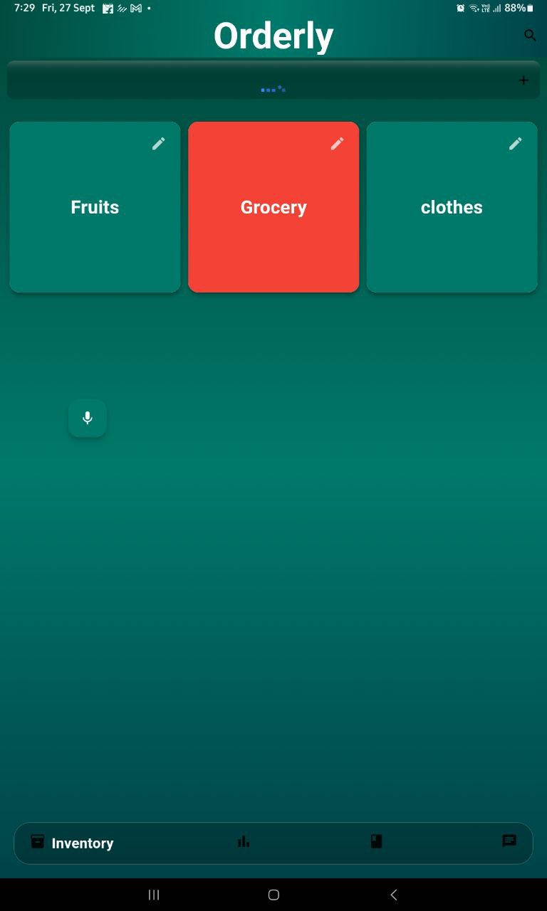
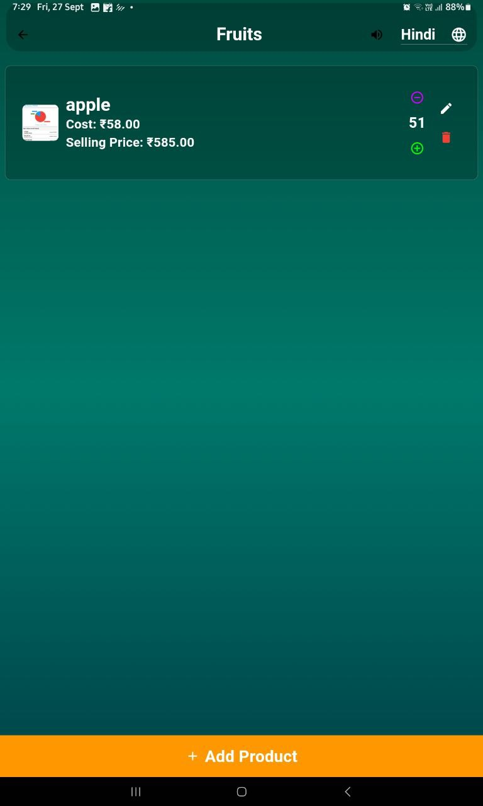
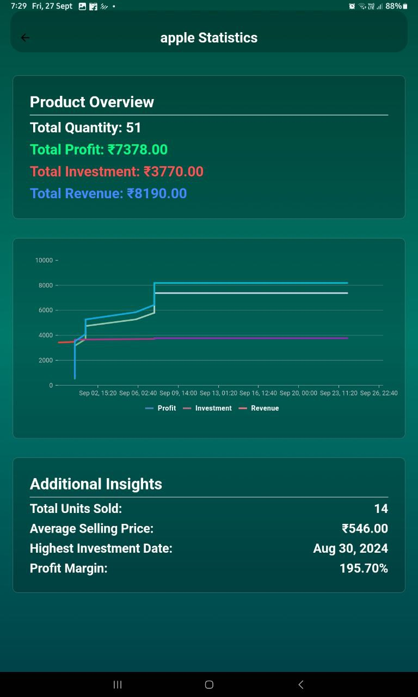
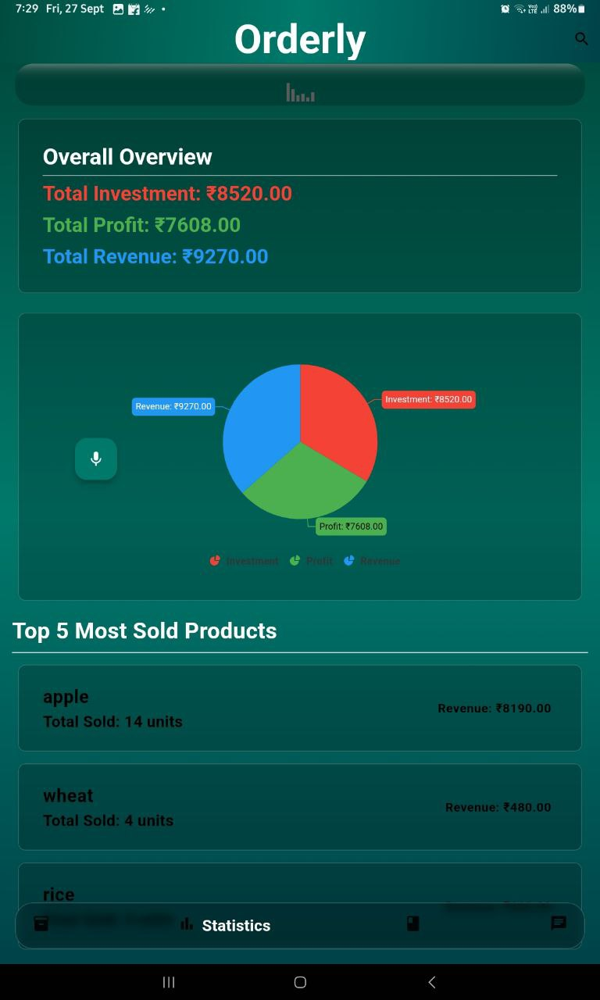
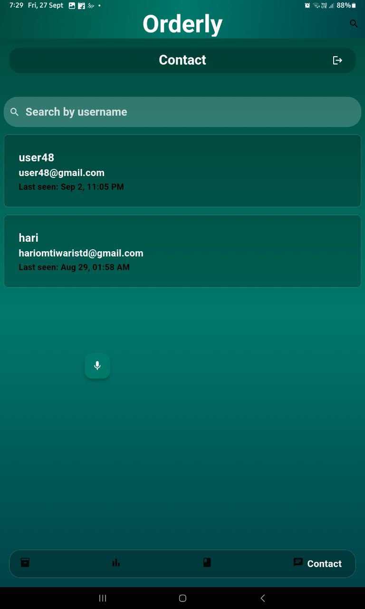

## Orderly

Orderly is a Flutter-based application designed for inventory management, customer transactions (Khata), and real-time chat functionalities. The app utilizes Firebase for backend services, offering authentication, real-time data handling, and push notifications. It is designed for small businesses to efficiently track inventory, manage customer transactions, and communicate effectively.

Features

	•	Inventory Management: Easily manage your product stock levels and inventory, adding or editing products in a few clicks.
	•	Customer Transactions (Khata): Record and track payments, view transaction history, and maintain customer balances efficiently.
	•	Real-Time Chat: Seamless communication between users with built-in chat functionality for quick messaging and collaboration.
	•	Statistics & Insights: Visualize sales, investments, and revenue with dynamic charts for quick data-driven decisions.
	•	Voice Assistant: Navigate and search the app hands-free using voice commands with integrated text-to-speech and speech-to-text capabilities.
	•	Firebase Integration: Secure authentication, real-time data sync, and instant push notifications with Firebase Cloud Messaging (FCM).


## Screenshots

<table>
  <tr>
    <td>
      
    </td>
    <td>
      
    </td>
  </tr>
  <tr>
    <td>
      
    </td>
    <td>
      
    </td>
  </tr>
  <tr>
    <td colspan="2">
      
    </td>
  </tr>
</table>
Installation

Prerequisites

Ensure you have the following:

	•	Flutter SDK: Install Flutter
	•	Firebase account and project setup

 
Folder Structure

```
lib/
│
├── main.dart                             // Entry point of the application
│
├── firebase_options.dart                 // Firebase configuration file generated by FlutterFire CLI
│
├── components/                           // Reusable UI components
│   ├── blurred_card.dart                 // Widget for a blurred background card
│   ├── chat_bubble.dart                  // Widget for displaying chat messages
│   ├── const.dart                        // Contains constant values like background gradients
│   ├── my_button.dart                    // Custom button widget
│   └── my_text_field.dart                // Custom text field widget
│
├── models/                               // Data models for various entities
│   ├── credit.dart                       // Model for credit transactions
│   ├── customer.dart                     // Model for customers
│   ├── inventory.dart                    // Model for inventory items
│   ├── message.dart                      // Model for chat messages
│   ├── product.dart                      // Model for products and associated sales/investments
│   └── transaction.dart                  // Model for transactions with customers
│
├── screens/                              // App screens and pages
│   ├── chat/                             // Chat-related screens
│   │   ├── chat_home_screen.dart         // Home screen for chat
│   │   ├── chat_page.dart                // Screen for individual chat conversation
│   │   ├── login_page.dart               // Screen for login
│   │   └── register_page.dart            // Screen for registration
│   │
│   ├── inventory/                        // Inventory-related screens
│   │   ├── add_product_screen.dart       // Screen for adding or updating a product
│   │   ├── inventory_list_screen.dart    // Screen displaying the list of inventories
│   │   ├── product_detail_screen.dart    // Screen for viewing product details
│   │   ├── product_list_screen.dart      // Screen displaying list of products in inventory
│   │   ├── product_statistics_screen.dart // Screen for showing statistics for a product
│   │   └── inventory_search_delegate.dart // Search functionality for inventory
│   │
│   ├── khata/                            // Customer ledger-related screens
│   │   ├── khata_screen.dart             // Main screen for customer khata (ledger)
│   │   └── customer_transaction_screen.dart // Screen for transactions with a specific customer
│   │
│   ├── statistics/                       // Statistics-related screens
│   │   └── statistics_screen.dart        // Screen for general statistics overview
│   │
│   ├── auth_gate.dart                    // Handles authentication logic to show correct screen
│   └── home_screen.dart                  // Main app screen with bottom navigation bar
│
├── services/                             // Backend services and logic
│   ├── auth/                             // Authentication-related services
│   │   ├── auth_service.dart             // Handles authentication logic and Firebase integration
│   │   └── login_or_register.dart        // Handles the toggle between login and register
│   │
│   ├── chat/                             // Chat-related services
│   │   └── chat_service.dart             // Manages chat functionalities (e.g., sending messages)
│   │
│   ├── announcement_service.dart         // Service for text-to-speech announcements
│   ├── voice_assistant.dart              // Manages voice assistant logic (speech-to-text, TTS)
│   └── firebase_messaging_service.dart   // Service for Firebase Cloud Messaging
│
├── widgets/                              // Widgets for UI elements
│   └── product_tile.dart                 // Widget for displaying product details in a list
│
├── database_helper.dart                  // Helper for local SQLite database operations
└── utils/                                // Utility functions and helpers (optional)
    └── utils.dart                        // Contains utility functions used across the app

```
